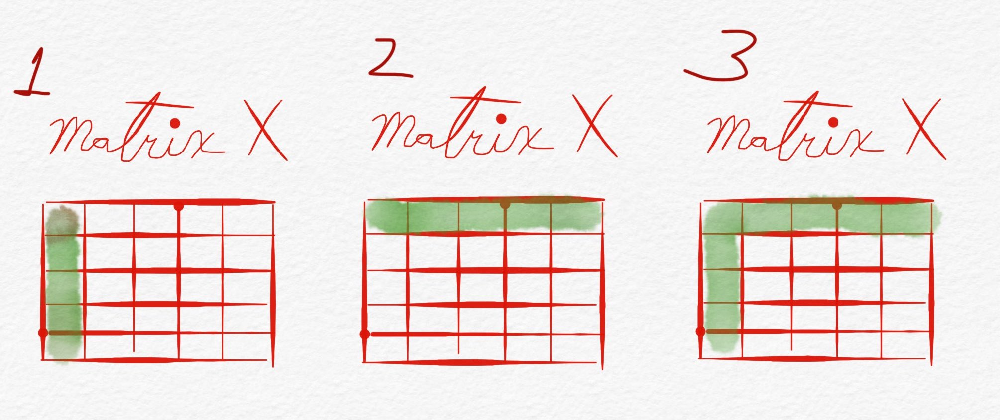
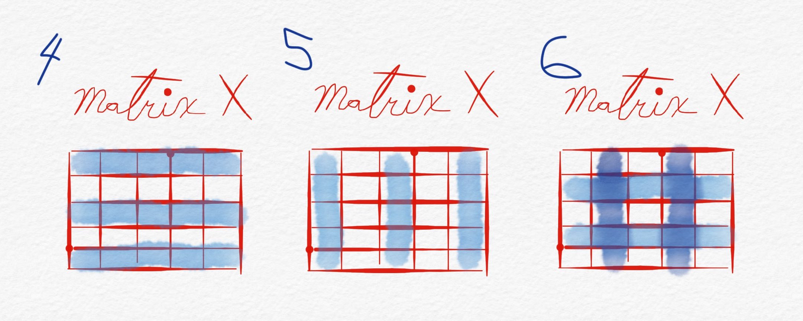
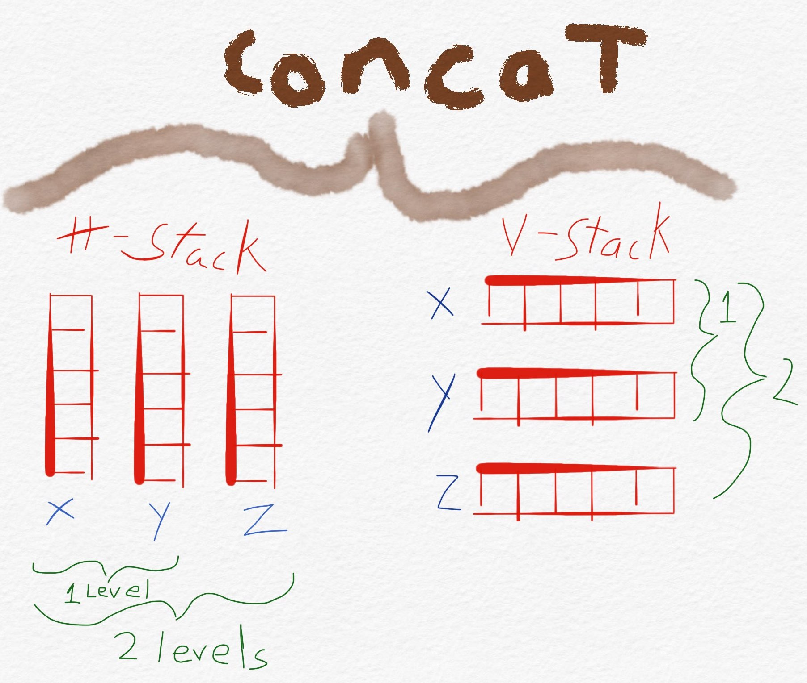

> "Learning is synthesizing seemingly divergent ideas and data." ~ Terry Heick

You can run through the exercises with the following links.

<div class="grid cards" markdown>

- :simple-jupyter: [__Download Jupyter Notebook__]()
- :fontawesome-brands-js: [__Open in Colab__ for interactivity]()
- :fontawesome-brands-css3: [__Open in Binder__]()
- :simple-github: [__Open in GitHub Codespaces__]()

</div>

> "The important thing to remember about mathematics is not to be frightened" ~ Richard Dawkins


## 1. Intro to Numpy


**Source:** https://en.wikipedia.org/wiki/NumPy

Numpy stands for Numerical Python and it is one of the core libraries in the suite of Python 
tools for data science and other numerical applications. Because of its numerical capabilities 
and speed, a lot of the libraries and packages in the data world depend on this wonderful tool.

The library allows us to run fast computations with arrays and matrices and calculate simple-to-complex 
mathematical calculations at great speed. One of the reasons why it is so powerful and fast is 
that it is partly written in the C programming language. This means that computations with 
NumPy are executed much closer to the hardware of our computers than the regular lists in Python. We 
will compare the speed of both, lists and numpy arrays, later in this lesson to better understand 
the speed differences between the two.

Main Characteristics of NumPy:

- Many built-in mathematical functions
- Efficient computations with n-dimensional arrays (n is the number of dimensions)
- Very fast
- It allows for broadcasting. This is the equivalent computation of a loop but without the loop. Meaning, for a lot of tasks with large datasets, you won't need to create a loop
- NumPy arrays use less computer memory than built-in Python equivalent data structures
- Excellent tool for generating random data. This will be useful if you would like to simulate different scenarios in your analysese

Now, let's start coding.

## 2. Arrays and Matrices

Let's begin by importing NumPy with its industry alias. An alias is the nickname you give 
to the modules/libraries/packages you import, for example, `import cool_package.killer_function as kf` or 
`from my_great_package.hello import greetings_mom as gm` will both boil down to `kf` and `gm` respectively.


```python
import numpy as np
```

Once you import numpy, and any other package for that matter, you can often check the version 
you are using with `package.__version__` as shown next.


```python
np.__version__
```

```
'1.26.2'
```

Arrays in numpy are similar to lists but they differ in that they can only contain 
one data type. If you have ever added a number to a column, row, or both in Excel 
then you have already worked with arrays and matrices. If you have ever written a 
list of different things you needed to buy at the supermarket, as well as the quantity 
of each item, then you have already created a two-dimensional array or matrix.

Thinking of numpy arrays as the components of a spreadsheet will help you get a better  
mental picture of these concepts.

| Index |    Date   |     Item     |  Quantity |
|:-----:|:---------:|:------------:|:---------:|
|   1   | 12-Apr-20 | toilet paper |   1000    |
|   2   | 20-Apr-20 | chicken      |     10    |
|   3   | 27-Apr-20 | toilet paper |    500    |
|   4   | 27-Apr-20 | cereal       |      2    |
|   5   | 27-Apr-20 | bread        |      1    |

We can start working with arrays by passing in a list of data to the `np.array()` method. 
This method takes in Python lists (single or nested) and transform them immediately into 
the `ndarray` dataclass.


```python
# Create your first array
first_array = np.array([25, 40, 50, 16, 10, 19, 32, 27, 11])
print(first_array, type(first_array))
```
```
[25 40 50 16 10 19 32 27 11] <class 'numpy.ndarray'>
```

You've probably already seen the native Python function, `range()`, which creates a range 
of values up to but not including the stoping point, and with an optional step in between. 
The equivalent of this function in numpy is the `np.arange()` (pronounced _a-range_ not 
_arrange_). The nice thing about the numpy's version is that we can add an additional parameter 
that lets us pick the data type of the array. Even thought you might not have to worry about 
this until you tackle more advanced problems with larger datasets, the difference between an 
8-bit integer (`int8`) and 64 one (`int64`) can be drastic, effectively increasing or 
decreasing the amount of time a computation might take.

Let's use both, `range()` and `np.arange()` to see how they work.


```python
# since range() is a lazy function, we have to wrap it around a list() to print its values
print(list(range(10))) # create array of 10 numbers from 0 to 9
print(list(range(0, 10))) # create array of 10 numbers from 0 to 9
print(list(range(0, 10, 2))) # create array of even numbers from 0 to 9. Stepwise operation!
```
```
[0, 1, 2, 3, 4, 5, 6, 7, 8, 9]
[0, 1, 2, 3, 4, 5, 6, 7, 8, 9]
[0, 2, 4, 6, 8]
```

```python
# NumPy example
print(np.arange(10)) # create array of 10 numbers from 0 to 9
print(np.arange(10, dtype='int8')) # create array of 10 numbers from 0 to 9 and with integers of 8 bites
print(np.arange(0, 10, dtype='int32')) # create array of 10 numbers from 0 to 9 and with integers of 32 bites
print(np.arange(0, 10, 2, dtype='int64')) # create array of 5 even numbers from 0 to 9. Stepwise operation  and with integers of 64 bites
```
```
[0 1 2 3 4 5 6 7 8 9]
[0 1 2 3 4 5 6 7 8 9]
[0 1 2 3 4 5 6 7 8 9]
[0 2 4 6 8]
```

NumPy comes with its own attributes for checking the shape, data type, and dimensions 
of an array. This can come in handy when working working with images or ton investigate 
any data we might be given with little information about it.

When we use the attribute `.shape` on an array, we get back a `tuple` with the rows as 
the first element and the columns as the second element. The `.dtype` attribute tells us 
the data type of the array or matrix, and the `.ndim` attribute gives us the dimensions.


```python
print(first_array)
```
```
[25 40 50 16 10 19 32 27 11]
```

```python
print(first_array.dtype) # data type
print(first_array.shape) # (rows, columns)
print(first_array.ndim) # dimension
```
```
int64
(9,)
1
```

In addition to lists, tuples and sets can also be passed into a numpy array.

```python
# this is a matrix of multiple lists
matrix_list = [[1, 2, 3, 4],
               [20, 22, 27, 15], 
               [11, 14, 19, 7]]
print(matrix_list)
```
```
[[1, 2, 3, 4], [20, 22, 27, 15], [11, 14, 19, 7]]
```

```python
matrix_array = np.array([[1, 2, 3, 4], # this is a matrix of multiple arrays
                         [5, 6, 7, 8], # even though it looks just like a bunch of lists
                         [9, 8, 7, 6]]) # it is treated differently by numpy
matrix_array
```


```python
# this is a matrix created from the list of lists above
ndarray_lists = np.array(matrix_list)
ndarray_lists
```


```python
print(matrix_list, type(matrix_list))
print("-" * 40)
print(matrix_array, matrix_array.dtype)
print("-" * 40)
print(ndarray_lists, ndarray_lists.dtype)
```


```python
# this is a numpy matrix of multiple arrays with strings

matrix_text = np.array([["Hi", "this", "is", "a"],
                         ["matrix", "that", "only", "contains"],
                         ["text", "and", "no", "numbers"]])
matrix_text
```

If you are ever unsure of the number of dimmensions a numpy array has, you can always check this with the `.ndim` attribute. Also, whenever you see a list of lists, it helps to think of it as an Excel spreadsheet (i.e. a 2-dimensional grid of information).


```python
print(matrix_text.ndim)
```

We can also select (i.e. slice and dice) elements from an array in the same fashion as with lists, but with an additional functionality that allows us to pinpoint exactly what we want by selecting columns and rows within the same bracket of an array in multiple dimensions.

Here is an example of how slicing data out of a numpy array works.

> **array[start:end:step, start:end:step]**

Let's see what the construct of `array[rows,columns]` looks like by starting with the rows first.


```python
print(f"Our first array --> {first_array} has {first_array.ndim} dimension(s)")
print("-" * 40)
print(f"We can select one element --> {first_array[0]}") # select an element first row
print("-" * 40)
print(f"More than one element with regular indexing --> {first_array[:5]}") # select elements from 0 to 4
print("-" * 40)
print(f"And more than one element with negative indexing --> {first_array[2:-3]}") # select elements from the 3rd to the third to last
# negative indexing starts from the end without using 0
```

## Exercise 2

1. Create an array of with 30 even numbers of data type `int32` and assign it to a variable named `thirty_nums`.
2. Select the last 10 elements of the array using a negative index in a slice and assign it to the variable `ten_nums`.
3. Sum all 10 numbers and assign the result to a variable called `one_num`.


```python
# create the array

```


```python
# create the slice

```


```python
# sum the slice

```

## Exercise 3

1. Create a Python list with 5 numbers.
2. Create a Python list with 5 words.
3. Create a NumPy matrix with the two lists above and assign it to a variable called `mixed_data`.
4. Select a word from the matrix and change it to `ice cream`. Assign it to a variable called `icy`.
5. Select a number from the matrix and change it to 777. Assign it to a variable called `lucky_number`.


```python
# list of nums

```


```python
# list of words

```


```python
# mixed matrix

```


```python
# change a word

```


```python
# change a number

```

To select elements from a matrix we need to have a comma `,` separating our data. The rows are on the left and the columns will be on the right. The colon `:` still allows us to select a range, and adding an additional colon `:` allows us to select elements with steps in between.

Being able to select columns becomes specially useful when we have different data in our arrays. Think about our shoping list again (a mix of arrays), when we go grocery shopping, we will need to select specific elements from our list as we go through the isles of the supermarket.

  

> **matrix\[start:end:step, start:end:step\]**


```python
matrix_array
```


```python
print(matrix_array[1, 3]) # element on second row and second column
```


```python
print(matrix_array[:, 3]) # all rows of column 2
```


```python
print(matrix_array[:, :]) # all rows and columns i.e. a full copy
```


```python
print(matrix_array[:, :2]) # everything in the first two columns
```

Let's clear a bit the distinction between the concepts we have covered. Selecting one element of an array/matrix can be considered indexing, and selecting a group of elements from an array/matrix can be thought of as slicing your data.

Before we jump into some exercises, let's go over a few more examples. We will start by createing a 5 by 5 matrix and call it `matrix_x`.


```python
matrix_x = np.array([[15, 41, 30, 11, 29],
                    [22, 8, 13, 10, 14],
                    [31, 19, 45, 16, 23],
                    [17, 16, 33, 1, 34],
                    [6, 27, 38, 25, 18]])
matrix_x
```

Let's figure out how to select the following rows and columns from Matrix X.




```python
matrix_x
```


```python
# Matrix X number 1

# We want all rows in the first column
matrix_x[:, 0]
```


```python
# Matrix X number 2

# We want the first row and all columns
matrix_x[0, :]
```


```python
# Matrix X number 3

# We want the intersection of the first column and the first row
matrix_x[0, 0]
```

Let's make things a bit more interesting by scaling the complexity of how we slice our matrix X.




```python
# Let's print matrix x again
matrix_x
```


```python
matrix_x.shape
```


```python
# Matrix X number 4

# We want all columns and every other row
matrix_x[::2, :]
```


```python
# Matrix X number 5

# We want all rows and every other column
matrix_x[:, ::2]
```


```python
# Matrix X number 6

# We want every other row and column starting from the second one of each
matrix_x[1::2, 1::2]
```

You can also add values to these numbers and reasign the new values to a new variable.


```python
temp_matrix = matrix_x[1::2, 1::2] + 5
temp_matrix
```

For our last example, let's explore how to get values at a specific point in our matrix.


```python
# Let's print matrix x again

matrix_x
```


```python
# Matrix X number 7

# We want the first, third, and fifth element of the first, third, and fifth column-row combination
matrix_x[[0, 2, 4], [0, 2, 4]]
```


```python
# Matrix X number 8

# We want the elements at the:
# second row and first column
# first row and second column
# fourth row and third column
# fifth row and fourth column
# third row and fifth column

matrix_x[[1, 0, 3, 4, 2], [0, 1, 2, 3, 4]]
```


```python
# Matrix X number 8

matrix_x[-1, []]
```


```python

```

## Exercise 4

1. Create a matrix with 4 rows and 5 columns.
2. Select the first and last columns and add the result to a new variable.
3. Add 5 to the first column and multiply the second by 10.


```python

```


```python

```

## Exercise 5

1. Create a matrix with 6 rows and 3 columns.
2. Select the first, third, and fifth rows.


```python

```


```python

```

## Exercise 6

1. Create a matrix with 5 rows and 9 columns.
2. Select every third column starting from the first one.


```python

```


```python

```

## 3. Generating Data With NumPy


We have already seen how to create numpy arrays of different dimmensions, however, numpy has even more functionalities that allow us to generate data on the fly either as a one-dimensional array or multiple.

Here are some of the most important functions to generate data with numpy.

- `np.arange(start, end, step, dtype='something')` will create a one-dimensional array
- `.reshape(4, 5)` this method can be applied to almost any array and it will reshape it into a matrix or other n-dimensional array
- `np.zeros(nums, dtype='something')` creates an array full of zeros
- `np.ones((rows, columns), dtype='something')` creates an array/matrix full of ones
- `np.random.random(num)` creates an array of random values from 0 to 1. If passed in a tuple such as (3, 5), it will crate a matrix of random values
- `np.linspace(start, end, nums_in_between)` creates an array of linearly-spaced numbers from the start point to the end with a user-defined amount of numbers in between
- `np.random.normal(mean, std, size)` draws random numbers from a normal distribution with the mean, standard deviation, and size of your choosing
- `np.random.randint(start, end, shape)` creates random integers
- `np.full(shape, num_you_like)` creates an array or matrix with the same number all accross
- `np.empty()` creates a completely empty array of a size and shape of your choosing

You might be wondering, why would I use all of these data generating functions if I will always have data for my use case? The answer is that no model is perfect, and sometimes, a bit of simulation can save you a lot of time in your work or within a project. In addition, there are analyses that are way too costly or harmful to run a test on and collect new data from. For example, flight routes, weather, car crashes, etc., and simulating scenarios in these use-cases would save a lot of time, money, effort, and even lives.

Let's go over some examples of each.


```python
import matplotlib.pyplot as plt

%matplotlib inline
```


```python
# let's create a one dimmensional array
arr1 = np.arange(0, 50, 0.5, dtype='float')
arr1
```


```python
# we will plot our array against the same array but with every element raised to the power of 2
plt.plot(arr1, (arr1**2))
plt.show()
```

Let's now turn our array into a matrix while keeping in mind that the product of the rows and columns of a matrix should be equal to the lenght of the array. Hence, if our array has 50 values, our columns times our rows has to be equal to 50 (10x5, 2x25).


```python
len(arr1)
```


```python
matrix1 = arr1.reshape(10, 10).copy()
matrix1
```


```python
arr1.reshape(20, 5)
```


```python
arr1.reshape(5, 20)
```


```python
arr1.reshape(25, 4)
```

You might be wondering why we used the `.copy()` above and the reason is that the data numpy keeps in memory for any given array doesn't change when the pointer changes (i.e. a new variable assignment) unless we create a copy. So essentially arr1 and matrix one would be sharing the same data and whathever happens to matrix1 would happen to arr1 and vice-versa.

Let's visualise this with an example.


```python
# Let's create an array with 10 zeros
zeros_arr = np.zeros(10, dtype='int8')
zeros_arr
```


```python
print(f"Here is the original array --> {zeros_arr}") # here is the original array
print('-' * 55)

new_zeros = zeros_arr # here is our new copy

new_zeros[4] = 5 # let's change the value at index 4

print(f"Here is the new, altered array --> {new_zeros}") # let's print the modified one

print('-' * 55)

print(f"Here is the original again --> {zeros_arr}") # and let's print the original as well
```


```python
new_zeros = zeros_arr.copy()
new_zeros[4] = 10
new_zeros
```


```python
zeros_arr
```

Now that we know that arrays can be fixed in memory and shared with other varables, or be copied to another variable. Let's continued exploring our data generation functions.


```python
# the ones and only : )
matrix2 = np.ones((4, 5), dtype='float32')
matrix2
```


```python
# have now become the lucky seven's
matrix2 + 6
```


```python
# how about having lot's of tiny spaces in between two numbers
arr2 = np.linspace(-10, 10, 100)
arr2
```


```python
# what would the cosine of our previous array and the original array look like when plotted
plt.plot(arr2, np.cos(arr2))
plt.show()
```


```python
# everyone needs random integers every now and then
# from 10 to 50 give me 100 randoms
arr3 = np.random.randint(low=0, high=50, size=100, dtype='int8')
arr3
```


```python
plt.plot(sorted(arr3))
plt.show()
```


```python
# distributions are everywhere and the normal ones tend to follow us (hint: the weather 🌤🌧🌞)
arr4 = np.random.normal(loc=12, scale=6, size=200)
arr4
```


```python
plt.hist(arr4, bins=30, color='green')
plt.show()
```


```python
# these are completely empty even though they appear not to be
arr5 = np.empty((3, 5), dtype='float32')
arr5
```


```python
# to look at the shape of this array we use
arr5.shape
```


```python
# we can fill in the rows and/or columns with new values
arr5[0] = (5**2) # first row will have 25s
arr5[0]
```


```python
arr5[1] = (25 / 5) # second row will have 5s
arr5[2] = 17 # third row only 17s
arr5
```


```python
# Let's create a matrix with a number we like
filled_matrix = np.full(shape=(3, 5), fill_value=17, dtype='int8')
filled_matrix
```

## Exercise 7

1. Create an empty matrix of 3 by 5 dimensions. Add it to the variable `empty_matrix`.
2. Add positive numbers to the odd columns.
3. Add negative numbers to the even columns.


```python
# create a 3 by 5 matrix

```


```python
# add positive numbers to the odd columns

```


```python
# add negative numbers to the even columns

```

## Exercise 8

- Create a one dimensional array of 80 random numbers of type `float32`. Call it `my_randoms`.
- Reshape the array into a matrix of at least 8 rows. Call it `rand_matrix`.
- Create a slice of the even columns and odd rows. Call it `silly_slice`.


```python

```


```python

```


```python

```

## 4. Computations with NumPy


Let's begin this section with a quick comparison between operations on regular Python lists and operations on NumPy arrays.


```python
# let's create a list with 10M numbers
comp = list(range(10_000_000))
```


```python
%%time

# let's add 1 to each and then time it
some_list = []
for i in comp:
    some_list.append(i + 1)
```


```python
# let's create a numpy array of 10M
np_array = np.arange(10_000_000)
```


```python
# let's make sure our arrays have the same amount of elements
assert len(np_array) == len(comp), "They don't match!"
```


```python
%%time

# let's add 1 to each one of our numpy arrays
new_arr = np_array + 1
```

As you can see, the difference in speed is stark. Try to play with the 0s and see how things evolve with these 2 computations.

### 4.1 Operations


To be able to perform element-wise operations with 2 or more lists we need to do it either in a loop, a list comprehension, or add the numbers manually. With numpy, you can do element-wise operations without ever writing a loop, so long as your arrays are always of the same length or have a matching structure for between matrices and arrays. This last part is out of the scope of this course but it is important to learn about n-dimensional array operations to do more advanced work as you progress throughout your career.

Let's begin by adding two arrays.


```python
array1 = np.array([3, 2, 1])
array2 = np.array([9, 5, 7])

array1 + array2 # this addition will happen element-wise
```

What happens when we try to add python lists with other lists?


```python
l1 = [3, 2, 1]
l2 = [9, 5, 7]

l1 + l2
```

The correct way to do it with lists would be,


```python
l3 = []
for idx in range(len(l1)):
    l3.append(l1[idx] + l2[idx])

print(l3)
```

Or,


```python
l3 = [l1[idx] + l2[idx] for idx in range(len(l2))]
l3
```

Notice what happens when we try to add two arrays with different lenghts.


```python
# If the arrays do not have the same lenght, numpy will give us an error
array1 = np.array([3, 2, 1, 6])
array2 = np.array([9, 5, 7])

array1 + array2
```

If the arrays don't have the same length, numpy will give us an error.

We can also do element-wise operations on arrays using the rest of the mathematical functions we saw on lesson 1.


```python
# let's create 2 more arrays
array3 = np.array([3.7, 2.3, 1.8])
array4 = np.array([9.1, 5, 7.4])
```


```python
print(array3 * array4) # multiplication
```


```python
print(array3 / array4) # division
```


```python
print(array3 ** array4) # exponent
```


```python
print(array3 - array4) # subtraction
```

You also get the same functionality with a single number, only this time the single number will be applied to all elements in your array. This is also called broadcasting, and it is what we saw in the speed comparison at the beginning of this section.


```python
# notice the 10
print((array3 * array4) * 10) # multiplication
```


```python
print((array3 / array4) / 20) # division
```


```python
print((array3 ** array4) ** 2) # exponent
```


```python
print((array3 - array4) - 4) # subtraction
```


```python
print(array3 * 3) # multiplication
```

Can you guess what would happen to a python lists when we try to multiply it by a scaler?


```python
[1, 2, 3] * 3
```


```python
print(array3 / 10) # division again
```


```python
print(array3 ** 3) # exponentiation again but with 1 number only
```


```python
print(array3 - (-20)) # subtraction
```


```python
auto_array_1 = np.random.randint(low=5, high=20, size=40)
auto_array_1
```

If we wanted to make the one dimensional array above a two-dimensional one, e.g. a matrix, we could do it with the method `.reshape()` we say earlier, which takes as arguments the dimensions our new matrix should have. Please remember, the first number is always the rows and the second is always the columns.

What we have to keep in mind though is that the reshaped version has to match the amount of element in the array. For example, a one dimensional array with 20 elements can only be reshaped into a matrix of:
- 2 rows and 10 columns (2, 10)
- 10 rows and 2 columns (10, 2)
- 4 rows and 5 columns (4, 5)
- 5 rows and 4 columns (5, 4)


```python
len(auto_array_1)
```


```python
auto_array_1.shape
```


```python
print(f"New matrix: \n {auto_array_1.reshape(5, 8)}")
print(f"Same array: \n {auto_array_1}")
```

The `.reshape()` method does not work inplace so we would have to assign the new matrix to a new variable and chain the method `.copy()` to it if we want our reshaped matrix to be unique.


```python
auto_matrix_1 = auto_array_1.reshape(5, 8).copy()
auto_matrix_1
```

The opposite to reshape would be `.ravel()`. This method takes in a matrix of any shape and form and returns a 1-dimensional (flattened) array.


```python
print("Original matrix --> {}".format(auto_matrix_1))
print("-" * 45)
auto_array_2 = auto_matrix_1.ravel().copy()
print("New, unraveled array --> {}".format(auto_array_2))
```

### 4.2 Descriptive Statistics on Arrays


**Illustration Source:** http://www.lindavanbruggen.nl/

Now that we have learned how to create arrays, there are many operations we can do on arrays to try to understand the information they contain. For example, we can add all of their numbers, get their range, max and min values, and even learn how many even/odd numbers are in the array.

The kind of operations described above can also be referred to as descriptive statistics, which one of the branches of the field of Statistics. It gives us tools to interrogate the data and pull out some facts from it.

You can also think of descriptive statistics a regular analysis of data where no predictions of fancy modeling takes place. The importance of descriptive statistics in the data analytics/science cycle is monumental. It helps us examine our data and, more often than not, find inconsistencies that we had not previously encountered and will have to deal with.

Some useful statistics you should always begin with are:

- Minimum
- 25th percentile
- Median
- Mean
- Mode
- 75th percentile
- Maximum
- Count
- Standard deviation
- Variance


```python
auto_array_1
```


```python
print(f"Minimum Value: {np.min(auto_array_1)}")
```


```python
print(f"25th percentile: {np.percentile(auto_array_1, 25)}")
```


```python
print(f"Median: {np.median(auto_array_1)}")
```


```python
print(f"Average: {np.mean(auto_array_1)}")
```


```python
print(f"75th percentile: {np.percentile(auto_array_1, 75)}")
```


```python
print(f"Maximum Value: {np.max(auto_array_1)}")
```


```python
print(f"Count: {auto_array_1.size}")
```


```python
print(f"Total Sum: {np.sum(auto_array_1)}")
```


```python
print(f"Square root of the array: {np.sqrt(np.sum(auto_array_1))}")
```


```python
print(f"Sandard Deviation: {np.std(auto_array_1)}")
```


```python
print(f"Variance: {np.var(auto_array_1)}")
```

## Exercise 9

1. Create an array of 100 random numbers between 2 numbers of your choosing.
2. Build a function that takes in an array and prints at least 5 of the descriptive statistics shown above. Name it `clue_finder`.
3. Test your function on the array from step 1.


```python
# your random array

```


```python
# your function

```


```python
# test your function with your array

```

## Exercise 10

1. Using the array you created in exercise 9, reshape it into a matrix of dimensions (6, 8).
2. Sum every second column of that matrix matrix with a numpy function.


```python
# reshape your array here

```


```python
# sum every second column here

```

### 4.3 Combining Arrays

Sometimes, we will need to combine different arrays containing valuable information for a particular analysis. NumPy has three particular ways in which it allows us to do this:

- `np.vstack()` allows you to stack multiple arrays on top of one another, i.e. vertically or row-wise
- `np.hstack()` allows you to stack arrays next to each other, i.e. horizontally or column-wise
- `np.concatenate()` gives you both stacking options, vertical and horizontal stacking

Let's have a look at all three of these.





```python
x = np.arange(0, 20).reshape(5, 4)
y = np.linspace(0, 9, 20).reshape(5, 4)
z = np.ones(20).reshape(5, 4)

print("Here is the row length of \n x --> %i, \n y --> %i, and \n z --> %i" % (len(x), len(y), len(z)))
```


```python
# Horizontal Stack of x and y
h_level1 = np.hstack([x, y])
h_level1
```


```python
# horizontal stack of all three but with an operation on the third
h_level2 = np.hstack([h_level1, z + 2])
h_level2
```


```python
# vertical concatenation
v_level1 = np.vstack([x, y])
v_level1
```


```python
# vertical concatenation with an operation on z
v_level2 = np.vstack([v_level1, z + 7])
v_level2
```


```python
# horizontal concatenation
c_level1 = np.concatenate([x, y, z], axis=1)
c_level1
```


```python
# vertical concatenation
c_level2 = np.concatenate([x, y, z], axis=0)
c_level2
```

## 5. Masking


In the previous lesson, we explored conditional statements with if, elif's, and else constructors and noticed how powerful these functionalities can be when we try to evaluate statements based on logical conditions. NumPy allows us to take advantage of these logical statements to create powerful filtering methods.

One of the most common tasks of a data analyst is to dig deep into the data to figure out interesting relationships and patterns that could help us answer important questions. One way to achieve this is through filtering out data based on a given condition or set of conditions. NumPy allows us to do this quite efficiently and we will learn how to do this in this section.

Say we have an array of 1 year worth of temperatures in farenheit and we want to know how many days of the year the temperature was higher than 70 (a nice and probably sunny day 🌤).


```python
year_temp = np.random.randint(low=-30, high=115, size=360, dtype='int8')
year_temp[:20]
```

After we have our array of temperatures for the year, we can move on to creating the condition we want.


```python
nice_days_mask = (year_temp > 70) 
nice_days_mask
```

Notice that we now have an array of booleans where the True's corresponde to the days where the temperature was greater than 70 and the False's correspond to the days where it was equal to or lower than 70. Now, if we pass our new variable of booleans as an index to our `year_temp` array, we will get back only the values we want (i.e. the ones that evaluated to True in the condition above).


```python
nice_days = year_temp[nice_days_mask]
print(nice_days.shape, '\n\n', nice_days)
```

Now we can move on to answer some useful questions about our new filtered data. For example, we can examine the max temperature experienced during the nice days, or we could check out the average to understand what was the most common temperature during these days.


```python
print("The Average temperature on nice days was %i F ☀️" % np.mean(nice_days))
```


```python
print("The Max temperature on nice days was %i F 😎" % np.max(nice_days))
```


```python
print("The Min temperature on nice days was %i F 🌥" % np.min(nice_days))
```

You do not need to create these computation and assign them to a new variable, instead, you can pass them directly to the array in question the same way you would do your regular slicing. Let's look at an example together.


```python
year_temp[0:30] # regular slicing
```


```python
year_temp[year_temp < 80] # masking directly
```

We can also combine multiple logical evaluations and pass them as masks to our arrays. For example, imagine we are only interested in the days where the temperature was less than 80 and greater than 50. If so, we could wrap our comparisons around paretheses (i.e. round brackets) and separate them with the `&` or `|` objects in between two or more masks.


```python
# get only the days where the temp was less than 80 and greater than 50
year_temp[(year_temp < 80) & (year_temp > 50)]
```

Lastly, we could create a matrix resembling the days and months for the 360 (data points) days we have in our array. We could then use one of the many numpy aggregation functions to understand what happened in any given months. (We are simulation the weather in a year 😎.)

First, let's reshape this array into a matrix with 30 rows to represent the days in a month and 12 columns to represent the months in a year.


```python
matrix_year = year_temp.reshape(30, 12).copy()
matrix_year
```

The next step is to create our mask. We are interested in what we consider nice days. Which are days that are not too hot but also not too cold (e.g. not hotter than 100 degrees but also not colder than 70).


```python
# create the mask
good_days = (matrix_year > 70) & (matrix_year < 100)
good_days
```

Lastly, we will use the `np.sum(matrix, axis=0)` function while making the axis parameter equal to 1 so that numpy knows that we want the operation to pass through the mask matrix column-wise and not row-wise. That way we can count how many days per month throughout the year were within our criteria.


```python
np.sum(good_days, axis=0)
```

There are many other cool tricks you can do with with masking, and we will explore those as we progress throghout the course.

## Exercise 11

1. Go to [yahoo finance](https://finance.yahoo.com/), pick a company you like and figure out the minimum and maximum prices it traded for in the last year.
2. Create an array of 240 random floats with the minimum and maximum values determined in step 1.
3. Reshape your array into a matrix with 12 columns.


```python

```


```python

```


```python

```

## Exercise 12

1. Get the average price of each month on the matrix from exercise 11.
2. Create a mask to determinte the numbers between the 25th and 75th percentiles of the original 1-dimensional array not the matrix.
3. Test your mask in your 1-dimensional array with stock prices.


```python

```


```python

```


```python

```

Congratulations you are more and more resembling a full-fledged data analyst.

## 5. Summary

You have learned a great deal today and should be proud of your accomplishments. Let's recap what we have seen thus far.

1. Lists in Python can be treated as the arrays and matrices that will hold our data for us. They are extremely powerful and versatile data structures and can be used in almost every aspect of the data analytics cycle.
2. NumPy is a library built on top of the programming language C. This particular characteristic allows it to communicate with the hardware of our machines and run our computations faster than with regular Python code.
3. When possible, use broadcasting instead of loops in order to optimise your code and run-time.
4. Generating random data allows us to test models and functions very fast and numpy has a lot of useful methods to generate random data. It has functions such as `np.ones`, `np.random.random`, `np.linspace`, and many more.
5. Masking is a type of filtering method that allows us to have a closer look at our data. It is, in a way, a similar way of constructing if-else evaluations.
6. List comprehensions are a type of for loop that gives us the ability to generate a list from repeated commands.

## 6. References

Sweigart, Al. _Automate the Boring Stuff with Python: Practical Programming for Total Beginners_. No Starch Press, 2020.

VanderPlas, Jake. _A Whirlwind Tour of Python_. O'Reilly, 2016.

VanderPlas, Jake. _Python Data Science Handbook_. O'Reilly, 2017.
