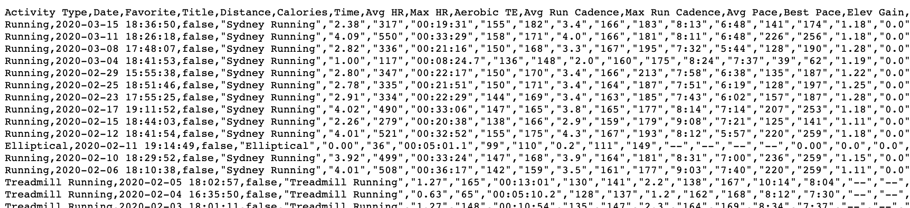
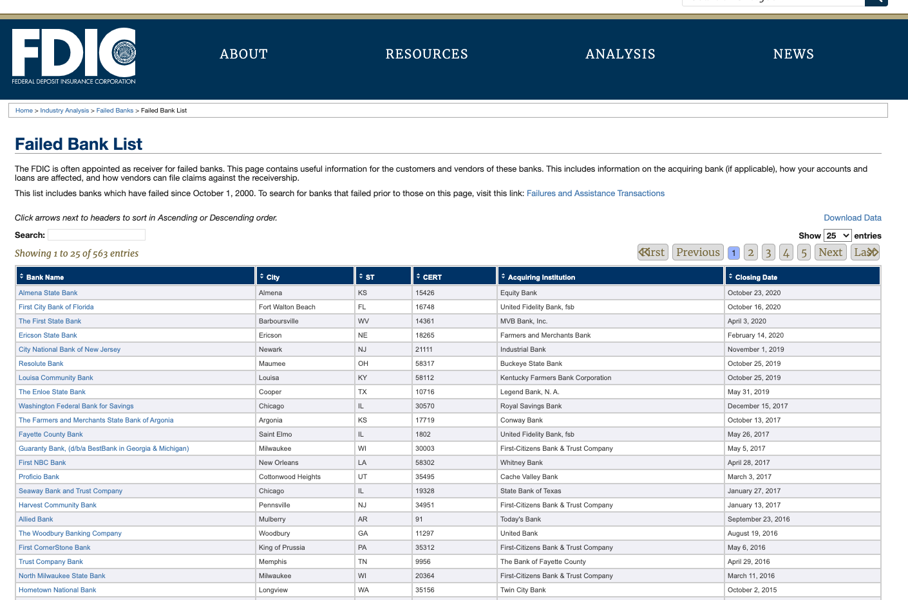

# 06 Getting Data into Python

> "You don’t understand anything until you learn it more than one way". ~ Marvin Minsky

> "Wear your learning, like a watch, in a private pocket: and do not pull it out and strike it, merely to show that you have one." ~ Lord Chesterfield


**Source:** [Vallerio Pellegrini](https://www.behance.net/valeriopellegrini)

## Notebook Outline

1. Getting Data Into Python
2. Text
3. Excel
4. HTML

# 1. Getting Data into Python


When working with data in Python you will encounter datasets coming in all shapes and formats, so it is crucial to understand how to deal with them in order to work with data. We will be covering the following 4 formats in this section (yes, there are only 4 here 😁):

- CSV --> Comma Separated Values --> `pd.read_csv(file, sep=',')`
- TSV --> Tab Separated Values --> `pd.read_csv(file, sep=' ')`
- Excel --> Microsoft Excel format (.xlsx) --> `pd.read_excel()`
- JSON --> JavaScript Object Notation --> `pd.read_json()`
- HTML --> Hypertext Markup Language --> `pd.read_html()`

For this part of the lesson, we will be using some real world datasets that you can find more info about (e.g. how to download them) in datasets directory one level above this one. Please download them and add them to the datasets directory for this course, or whichever directory you'd like to use.


# 2. Text Files

Text files are extremely common among organisations, and hence, they will form a big part of the files you will encounter in your daily work. More specifically, files with a format such as **Comma** and **Tab** separated values, along with other text files that use different delimiters, might amount to half (if not more) of the files that you will see at work.

These two formats, **Comma** and **Tab**, are still only a text file but they are very useful for saving and distributing small and large datasets in a tabular way. You can identify both kinds of files by looking at the suffix part in the name of a file, comma separated values will end in `.csv` while tab separated values will end with `.tsv`.

What makes these two files so similar is that they are both separated by something called delimiter. If you have a CSV or TSV file, try opening them in a plain text editor application (notepad for windows users and ) and notice what comes up.



Notice that in the example above, every value is separated by a comma and although the column headers can be found at the very top of the file (this is common practice) sometimes you might not even have them available. When we save files as TSV, CSV or with any other kind of delimiter, words with spaces in them will be wrapped around quotation marks to differentiate the spaces from the delimiter (which might be a space itself) in the data.

Lastly, let's talk about how pandas handles these types of files. To read text files into a DataFrame with pandas we can use the function `pd.read_csv()` or `pd.read_table()`. These functions, at the time of writing, have over 50 parameters that allow us to customise different specification on how we would like to read in the data. One of the most important parameters is the `sep=`, which allows us to define the delimiter we would like to read in the data with. `","` is the default for `pd.read_csv()` and `"\t"` is the default for `pd.read_table()`.

The following parameters are some of the most useful ones not only for reading in text files, but also to tackle, and save time with, many of the operations you might need to perform after reading the data. Please visit the pandas documentation for more info.

- `header=` --> tells pandas whether the first column contains the headers of the dataframe or not.
- `names=[list, of, column, names]` --> allows us to explicitly name the columns of a dataframe in the order in which they are read.
- `parse_dates=` --> gives pandas permision to look for what might look like date data and it will assign it the appropriate date data type format.
- `index_col=` --> allows us to assign a specific column as the index of our dataframe.
- `skiprows=\[1, 2, 3, 4\]` --> tells pandas which rows we want to skip.
- `na_values=` --> takes in a list of values that might be missing and assigns them the NaN value, which stands for not a number.
- `encoding=` --> data might coming in from a variety of sources could have different encodings, e.g. 'UTF-8' or 'ASCII', and this parameter helps us specify which one we need for our data.
- `nrows=4` --> how many rows do you want to read from a file. Very useful tool for examining the first few lines of large files.

Let's use the Air Quality Monitoring Dataset and first read in the CSV file and then the TSV one.


```python
import pandas as pd
```

The first argument is the name of the file as a string or the path to the folder where the data lives followed by the name of the file and its extension. Once you load the dataset and assign it to a variable, you can see its first 5 rows plus the column names using the method `.head()`, or the method `.tail()` for the last 5.


```python
# The first argument is the folder where the data lives and the name of the data

df_csv = pd.read_csv('../datasets/files/seek_australia.csv')
```


```python
df_csv.head()
```

Notice how the look and feel of our file resembles that of a spreadsheet in Excel or Google Sheets.

To read in Tab Separated Value files, all we need to do is to pass in the `sep=` argument to our `pd.read_csv()` function and provide pandas with the specific delimiter the data is split by. For tab separated values we use `\t`, but there are many other delimiters one can choose from.


```python
# air quality data in Australia
df_tsv = pd.read_csv('../datasets/files/Air_Quality_Monitoring_Data.tsv', sep='\t')
df_tsv.head()
```

There is another method in pandas that uses the Tab Separated Values delimiter `"\t"` as its default delimiter, and that is the `pd.read_table()` method. You should use whichever you prefer, especially since most of the options in one can be found in the other. This means that by indicating the `sep=','` with a comma, you can obtain the same result as with the `pd.read_csv()` and read in Comma Separated Values.


```python
# occupational licenses data
df_table = pd.read_table('../datasets/files/occupational_licences.tsv')
df_table.head()
```

If we know a dataset has dates in it we can also convert it to the datetime format provided by pandas as we read in the data. We can do this by putting the names of the columns that have dates in the `parse_dates=` parameter of our `pd.read_csv()` function.


```python
# The first argument is the folder where the data lives and the name of the data

df_csv = pd.read_csv('../datasets/files/Crashes_Last_Five_Years.csv', parse_dates=['ACCIDENT_DATE', 'ACCIDENT_TIME'])
df_csv.head()
```

Now we can extract additional information from our date variables with some attributes that you can find in the [dates section of pandas](https://pandas.pydata.org/pandas-docs/stable/reference/api/pandas.DatetimeIndex.html).


```python
# here we are accessing the year
df_csv['ACCIDENT_DATE'].dt.year.head()
```


```python
# here we are accessing the month
df_csv['ACCIDENT_DATE'].dt.month.tail()
```

## Exercise 1

Go to any of the websites below, download a dataset of your choosing and read it into memory with `pd.read_csv()`. Use at least one additional argument to read in your file.

- [Kaggle Datasets](https://www.kaggle.com/datasets)
- [UC Irvine Machine Learning Repository](https://archive.ics.uci.edu/ml/index.php)
- [Data.GOV](Data.gov)
- [FiveThirtyEight](https://data.fivethirtyeight.com/)


```python

```


```python

```


```python

```

# 3. Excel Files


Excel files are very common, especially if some or all of the members in your team use it for their analyses and tend to share these with us periodically. If this is the case for you, this would mean that you would have to constantly read Excel files at work either with Excel or Google Sheets. But that is up until this point, of course. Fortunately, pandas provides a nice method to read in excel files, that is flexible enough to allow you te read in specific sheets at a time if that is what your use case requires.

The pandas function, `pd.read_excel()`, just like `pd.read_csv()`, provides a plethora of options that you can choose from to tackle the complexity with which many Excel created.


```python
# read in a regular file
df_excel = pd.read_excel("../datasets/files/supermarket_demo.xlsx")
df_excel.tail()
```

If you open up the supermarket dataset you will notice that it contains 2 sheets. pandas function `pd.read_excel()` by default reads in the first sheet it finds in a spreadsheet so in our case, that is the myanmar dataset as shown above. Let's now read in the egypt one with the help of the `sheet_name=` argument.

Note that in the call below we also use the `parse_dates=True` argument instead of specifying the columns we want to parse, this is to tell pandas to infer which variables represent dates while it reads in the data. This method works well often but in most cases, it is better to be explicit about which variables you would like to parse as date type as opposed to leaving it to pandas.


```python
df_excel = pd.read_excel("../datasets/files/supermarket_demo.xlsx", sheet_name='egypt', parse_dates=True)
df_excel.tail()
```


```python
# check the new type
type(df_excel['date'][0])
```


```python
type(df_excel.loc[0,'date'])
```


```python
type(df_excel.iloc[0,8])
```

## Exercise 2

1. Find an Excel (or any spreadsheet) file in your computer that has data in a tabular format (i.e. a big square with rows and columns) and read it into your session with `pd.read_excel()`.

2. If you can't find one to read in, create one with fake data and use that one insted. It does not need to have a lot of data in it. 10 rows and 5 columns would work fine.

3. If you don't have Excel, you can create a spreadsheet using Google Sheets and download it as an Excel file.

If neiether option above is feasible for you, please move on to the next section.


```python

```


```python

```


```python

```

# 4. HTML Files


> "Hypertext Markup Language (HTML) is the standard markup language for documents designed to be displayed in a web browser. It can be assisted by technologies such as Cascading Style Sheets (CSS) and scripting languages such as JavaScript." ~ [Wikipedia](https://en.wikipedia.org/wiki/HTML)

pandas has, among many things, a function to allow us to read [HTML](https://html.spec.whatwg.org/) tables from a website. This function is `pd.read_html()`, and although it is not a full-fledge web scraping tool such as [Scrapy](https://scrapy.org/) or [BeautifulSoup](https://www.crummy.com/software/BeautifulSoup/). These last two libraries are very powerful web scraping tools that you are more than encouraged to explore on your own. Intermediate to complex web scraping requires a fair amount of knowledge on how the structure of a website works but I have no dobts that with a few hours of focused studying, a couple of projects later, or in the next couple of minutes, you might be well on your way to scraping your own data with 🐼. 😎

Before we explore pandas method for web scraping, let's quickly define it:

> **Web Scraping** refers to extracting data, structured or unstructured, from websites and making it useful for a variety of purposes, such as marketing analysis. Companies in the marketing arena use web scraping to colect comments about their products. Others, like Google, scrape the entire internet to rank websites given a criterion or search query. While web scraping might be limited in scope to a single website, like what a marketer might do, **web crawling** is the art of crawling over many different and/or nested websites on one try, or repeadately over time, like what Google does.

We will be scraping the the International Foundation for Art Research website using the link below. An important thing to keep in mind is that, the pandas function `pd.read_html()` captures whichever tables it can find in the website provided and it then adds them to a list of dataframes where each  dataframe comes from a table. This means that you would have to first assign the list to a variable and then dump the table or tables you want into a combined dataframe.

http://www.ifar.org/catalogues_raisonnes.php?alpha=&searchtype=artist&published=1&inPrep=1&artist=&author=

How to check whether there is a table in a website or not. There are probably plenty of ways to check whether there is a table in a website or not, so here are two immediate ones.

1. See if there is a table-like shape in the website that you are interested in. This table would ideally have information in a shape that would fit into a pandas dataframe. For example,

2. The second option is to navigate to the website you are interested in and 

If you have any issues with the `pd.read_html()` function, please check and see if you have the following packages installed and then try again.

- `conda install lxml`
- `pip install beautifulsoup4 html5lib`


```python
data = pd.read_html('http://www.ifar.org/catalogues_raisonnes.php?alpha=&searchtype=artist&published=1&inPrep=1&artist=&author=')
```


```python
print(type(data), len(data))
```


```python
type(data[0])
```


```python
df_html = data[0]
df_html.head()
```

Notice that the column names are not where they should be. Let's fix that.

We will take the column names from the first row, convert the selection to a regular Python list and then reasign these names to the column names of our dataframe.


```python
# take the first row out and make it a list
col_names = df_html.iloc[0].tolist()
col_names
```


```python
# reasign the names to the column names index
df_html.columns = col_names

# drop the first row of the dataframe
df_html.drop(index=0, axis=0, inplace=True)
df_html.head()
```

## Exercise 3

Find a table to scrape in World Wide Web and read it in with pandas.


```python

```


```python

```

## Awesome Work!

You are now ready to start cleaning and preparing datasets for analysis!


