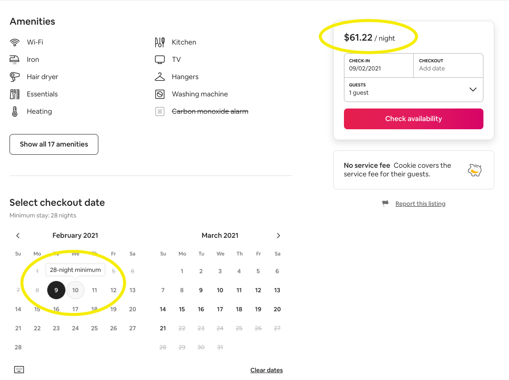

# 03 Analyze It


```python
from dask.diagnostics import ProgressBar
import pandas as pd
import os
import dask
import dask.dataframe as dd
import numpy as np
# from dask.distributed import LocalCluster, Client
from glob import glob
import urllib
from PIL import Image
import requests
from io import BytesIO
from utilities import check_or_add
import holoviews as hv
hv.extension('bokeh')

pd.options.display.max_columns = None
pd.options.display.max_rows = None
```


```python
path = '../data'
```


```python
clean_path = check_or_add(path, 'clean_files')
```


```python
ddf = dd.read_parquet(clean_path)
ddf
```

## Question 1

What does the distributions of prices we are dealing with look like?

To answe this question, we will first create a column called `true_price` and represent it with the true price of a stay at any listing. Which would be the price per night, times the minimum amount of nights per stay, plus the cleaning fee, plus the security deposit.




```python
true_price = ((ddf['price'] * ddf['minimum_minimum_nights']) + ddf['cleaning_fee'] + ddf['security_deposit'])
true_price.head(15, npartitions=15)
```


```python
host_since = dd.to_datetime(ddf['host_since'])
host_since.head()
```


```python
ddf1 = ddf.drop('host_since', axis=1).assign(true_price=true_price, host_since=host_since)
```


```python
true_price.describe().compute()
```


```python
freq, edges = np.histogram(ddf['price'], 100)
freq1, edges1 = np.histogram(ddf.loc[ddf.price < 800, 'price'], 100)
freq2, edges2 = np.histogram(true_price, 100)
freq3, edges3 = np.histogram(true_price[true_price < 800], 100)

layout_hist = hv.Histogram((edges, freq)) + hv.Histogram((edges2, freq2))
layout_hist
```


```python
hv.Histogram((edges1, freq1)) + hv.Histogram((edges3, freq3))
```


```python

```
