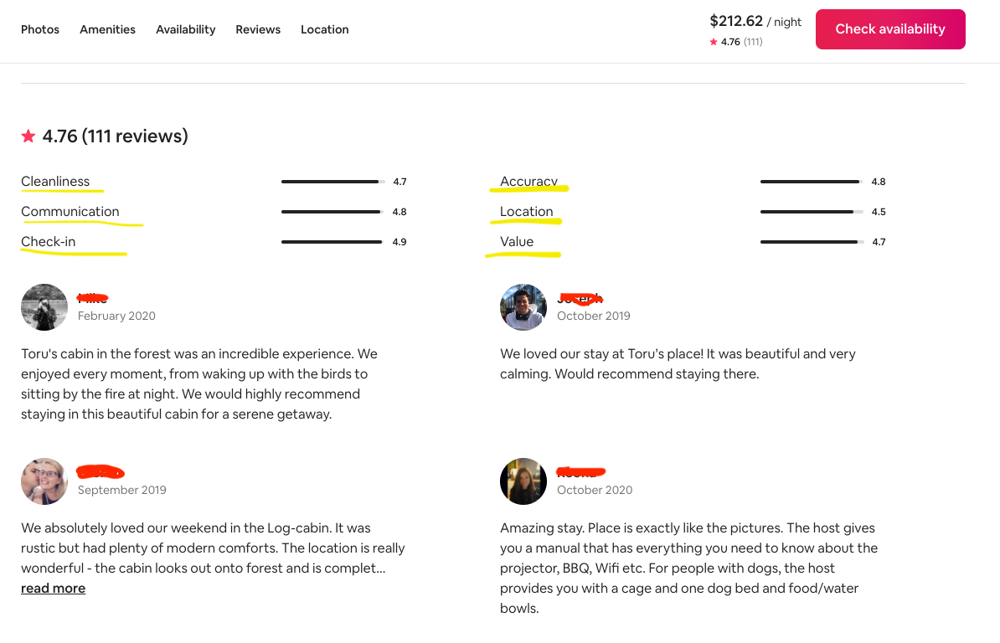

# 13 Data Prep Part 2

> _"There are only two forces in the world, ~~the sword~~ dirty data and ~~the spirit~~ clean data. In the long run the ~~sword~~ dirty data will (not) always be conquered by the ~~spirit~~ clean data."_ ~ Napoleon CleanYourData


## Outline for this Lesson

1. Data Cleaning Reminder
2. Cleaning 🐼
    - Dealing with Duplicates
    - Dealing with Missing Values
3. Saving our Cleaned Dataset
4. Test Your Understanding

## 1. Data Cleaning Reminder

Here is the data cleaning definition we saw earlier from a paper from Shaomin Wu titled, _"A Review on Coarse Warranty Data and Analysis"_ (see citation below).

> _"Data cleansing or data cleaning is the process of detecting and correcting (or removing) corrupt or inaccurate records from a record set, table, or database and refers to identifying incomplete, incorrect, inaccurate or irrelevant parts of the data and then replacing, modifying, or deleting the dirty or coarse data."_ ~ Wikipedia & Shaomin Wu

When we first encounter messy data, we usually start by going through a non-exhaustive checklist and/or use some rules of thumbs to identify, tackle, and repeat, each mess from the messy pile of data we have. Some of the items in our checklist might be:

- Do we have column names? If so,
- Are the column names normalised? (e.g. lower case, spaces or no spaces, numbers only as names)
- Do we have dates? If so,
    - how are these represented?
    - Do we have different formats in different rows? (e.g. 31-Oct-2020, October 31st 2020, ...)
    - Do they have the time in them or is this in a separate column?
- Are there different data structures within an element of an observation? (e.g. do we have lists with lists in them inside the value of a row and column combinantion)
- If we have numerical data points representing a monetary value, which denomination are these in?
- How was the data generated?
- Do we have any missing values? if so,
    - Are they missing at random?
    - Are they missing by accident? (e.g. was it due to an error during the data collection process)
    - Are they intentionally empty? (e.g. think of a conditional question in a survey, if the participant answered yes to the previous question, use this one next, if not, skip 3 questions)
- Are there any outliers in our dataset? if so,
    - Are these true outliers? (e.g. finding the salary of Jeff Bezos in a list with the income of all of the people from the state of Washington)
    - Are these mistakes? (e.g. finding negative prices for the price of bread)
- Are there any duplicate observations/samples in our dataset?
    
Remember, data cleaning is not a one time thing during the data analytics cycle but quite the opposite, you might find yourself going back to the data cleaning process 2 or more times as your understanding of the data increases during the same project.

**Source**  
Wu, Shaomin (2013) A Review on Coarse Warranty Data and Analysis. Reliability Engineering and System Safety, 114 . pp. 1-11. ISSN 0951-8320.

## 2. Cleaning

Before running the cell below create a text file and rename it to `utilities.py`. Open it and add to it the `check_or_add` function from the previous module and make sure you have `import os` at the top. Save it in the same folder as this notebook, and then run the next cell.

It is also very likely that you will not have the `currencyconverter` module installed so make sure you install it by running the following cell before loading all of your packages.


```python
# !pip install currencyconverter
```


```python
import pandas as pd
import os
import numpy as np
from glob import glob
import urllib # we will use this again to get more websites
from PIL import Image # we will be looking at some Airbnb images
import requests
from io import BytesIO # for the images
from collections import defaultdict # takes one data type or structure by default
from currency_converter import CurrencyConverter 
from utilities import check_or_add # our previously created function

pd.options.display.max_columns = None
pd.options.display.max_rows = None

# this magic command helps us to not reload our session every time we install a new package

%load_ext autoreload
```

We will add our data directory to a variable to make sure we always have it at our disposal.

**Note:** Make sure you change all of the forward slashes `/` into back slashes `\` if you are using Windows.


```python
path = '../data'

# uncomment this one if you have a windows computer
# path = '../data'
```

Without even examining the data we can already expect to have files with different columns depending on when the scraping took place, and what kind of data was available at that time. Let's now have a look at the columns we have for one of the datasets for Belgium.


```python
bel_path = check_or_add(path, 'belgium_data') # let's create a path variable for Belgium
```


```python
df = pd.read_csv(os.path.join(bel_path, 'csv_files','belgium_10.csv')) # if this is not the same number as yours, pick another one
len(df.columns), df.columns
```

Wow! That's a of variables to play with and a lot of columns to go over. Let's now examine the first few rows of our file with the `.head()` method.


```python
df.head()
```

Since we may not have the same variables for all datasets downloaded, we will create a function to loop over all datasets while extracting all columns from them.


```python
def get_columns(data):
    df_cols = list(pd.read_csv(data, low_memory=False, encoding='utf-8').columns)
    return df_cols
```

We need all of our CSV files so we will grab them using the same `glob` method from before. Notice that we now have multiple `*` because we need to go through each country's CSV folder.


```python
our_countries_data = glob(os.path.join(path, '*', 'csv_files', '*.csv'))
our_countries_data[:10]
```


```python
# let's have a look at how many files we have
len(our_countries_data)
```

We will now iterate over each of our files and append all of the columns to a list called `all_cols`.


```python
%%time

all_cols = []

for file in our_countries_data:
    cols = get_columns(file)
    all_cols.append(cols)
```


```python
all_cols[:2]
```

Awesome! It only took essentially nothing to grab the columns of each file so we ended up saving ourselves a lot of time. Imagine how long it would have taken us to check the columns of every dataset 1 by 1?


## Exercise 1

1. Get the length of each list of columns and add it to a list. **Hint:** Try to mirror the step above.

2. Calculate the average amount of columns from such list.


```python

```


```python

```

Answers below! Don't peak 👀


```python
%%time

all_nums = []

for cols in all_cols:
    nums = len(cols)
    all_nums.append(nums)
```


```python
%%time

np.mean(all_nums), all_nums
```

The next step we will take is to gather all of the columns in common in our data sample. To do this, we will first import the reduce function from the standard library called functools. We will then create an anonymous lambda function that takes a set `x` and a set `y` and then grabs the intersecting columns starting at `x` and reducing the set by all `y`s. This way, we will make sure we only grab the columns in common within all of our files.

In case you come back to this notebook later on and you want to try using different countries, you could convert the output of the previous cells we ran into a pandas dataframe and filter out the files without the specific amount of variables you need or want.

Here is an example of how to check whether any of the files we will use does not have 106 columns.

```python
temp = pd.DataFrame({'files':our_countries_data,
                     'columns':results,
                     'len': num_results})

temp.loc[temp['len'] != 106].head(50)
```


```python
from functools import reduce
```


```python
func = lambda x, y: set(x).intersection(set(y))
```


```python
def a_func(x, y):
    temp_var = set(x).intersection(set(y))
    return temp_var
```

Since the reduce function is lazy by default --meaning, no computation will take place until we tell it that we need the output-- we will wrap our reduce function in a list so that it returns the output immediately.


```python
clean_cols = list(reduce(func, all_cols))
clean_cols[:5]
```

Let's check out how many columns we have in common in all of our files.


```python
len(clean_cols)
```

Time to help ourselves even even further. Comma Separated Values tend to be quite messy, especially when they have multiple columns with many quotations marks and/or commas. When this happens, one or more can easily find its way into the wrong spot when we try to read in the data.

To start things off we will read in the data with all columns as strings (or python objects). The reason behind this is that you can already imagine that with columns with many valid elements such as dates, unique identifiers for purchases, etc., some are bound to miss the mark and thus be evaluated incorrectly. In essence, we will read everything in as a string and work our way through each column to fix or get rid of any of the many missing values we might have.

**Note:** for this example we will only use a dataset with 106 columns, if the one you chose at the beginning of the notebook has less than that, make sure you go back and read in one that does. If you are working on this notebook on your own, pick as many as you want! : )


```python
# we will use a dictionary comprehension to assign the string type to each column in our clean_cols list
dtypes = {col:str for col in df.columns}
len(dtypes), dtypes
```

We will now read in the data with have using only the files with 106 variables. Again, that is only for this example, use however many you like when working on your own.


```python
%%time

our_dataframes = []

for data in our_countries_data: # all of our files
    
    if len(get_columns(data)) == 106: # we will only read in the ones with 106 variables
        df_temp = pd.read_csv(data, low_memory=False, dtype=dtypes, usecols=dtypes.keys()) # we will create a temporary dataframe for each
        our_dataframes.append(df_temp) # and append them all to a list
        
df = pd.concat(our_dataframes) # we will then concatenate them together to have one and only one dataframe
df.head() # show the data
```

## Let the Real Cleaning Begin

We now finally read in our data and can begin the cleaning process.


Let's look at some of the information about our dataframes.


```python
df.info(memory_usage='deep')
```

## Dealing with Duplicates

Since we are expecting to have quite a few duplicates from the get go due to the scraping tool periodically grabing whatever listings are available in a country, we will tackle this at the very beginning. We will examine duplicates first using the `.duplicated()` function from pandas which will give us a boolean for the rows that have one or more copies of themselves in our dataframe.


```python
!pwd
```


```python
!dir
```


```python
%%time

dups = df.duplicated()
dups.sum()
```

Looks are deceiving and we certainly won't trust that there are no duplicated in our data. Let's examine our unique identifier columns to see whether we have a the same unique id for a host as the one applied by Inside Airbnb.


```python
df[['id', 'host_id']].head()
```

We don't have matching id's so we will need to first confirm whether we have random `id`s or if they actually have something to do with the `host_id` in order to determine the best way for identifying, and getting rid of, duplicates.

We will use the `.groupby()` method to create a multi-index Series with `host_id` as the first level, `id` as the second, and the count of the name of the listings as our values.


```python
%%time

id_frequency = df.groupby(['host_id', 'id'])['name'].count()
id_frequency
```

Indeed, it seems like we do have a lot of duplicated. But let's confirm this first by picking a random `host_id` and examining the dataframe with the `.head()` method.


```python
df[df['host_id'] == '10026319'].head()
```

As we can see, `host_id` represents a unique value assigned to the host of a listing regardless of how many that same host has available. In contrast, the `id` variable belongs to the unique listing.

Armed with this knowledge we can come up with two ways of dealing with the duplicate values.

1. We can use the combination of `host_id` and `name` (shown below), sort by the `last_scraped` variable to keep the latest one, and drop the duplicates, **or**  
2. We can use the `id` var (shown below), sort by the `last_scraped` variable to keep the latest one, and drop the duplicates.


```python
# option 1
df.loc[(df['host_id'] == '10026319') & 
        (df['name'] == 'Historical City Antwerp.'), ['name', 'last_scraped']].head(10)
```


```python
# option 2
df.loc[df['id'] == '10604260', ['name', 'last_scraped']].head()
```

We will use the combination of the `host_id` and `name` variables in our drop duplicates call so let's examine first how many duplicates we have.


```python
len(df)
```


```python
%%time

dups = df[['host_id', 'name']].duplicated()
dups.sum()
```


```python
_ / df.shape[0] * 100
```

It seems like we do have quite a few duplicates. Now that we have a good plan in place, let's create a function to deal with the duplicates and pass our dataframe through it.


```python
some_array = pd.Series([1, 3, 0, 20, 12, 45, 17])
some_array.sort_values(ascending=False)
```


```python
def get_rid_of_duplicates(data, sort_by_col, id_cols):
    """
    This function takes in a pandas dataframe, sorts it by a given column, and drops
    the duplicate rows given a unique column(s)
    """
    data1 = data.sort_values(by=sort_by_col, ascending=False)
    data2 = data1.drop_duplicates(subset=id_cols)
    
    return data2
```


```python
%%time

# notice that we create another dataframe with a cleaner version
df1 = get_rid_of_duplicates(df, sort_by_col='last_scraped', id_cols=['host_id', 'name'])
```


```python
df1.info(memory_usage='deep')
```


```python
dups = df1[['host_id', 'name']].duplicated()
dups.sum()
```

Awesome, we now have a deduplicated dataset in our hands.

If we get curious enough along we can use the following function to display a few of the images avaliable per listing. Let's try it out.


```python
def image_show(image_url):
    return Image.open(BytesIO(requests.get(image_url).content))
```


```python
images = df1.loc[df1['picture_url'].notnull(), 'picture_url']
images.head(100)
```


```python
image_show(images.iloc[3173])
```


```python
image_show(images.iloc[11940])
```


```python
image_show(images.iloc[2722])
```

Let's now deal with any missing values.

## Dealing with Missing Values


```python
%%time

# Get the raw count of missing values in all columns
missing_values = df1.isna().sum()

# Divide it by the total size of the dataset and multiply by 100 to get the % of the total
missing_pct = ((missing_values / df1.shape[0]) * 100)
missing_pct
```

We will start by selecting a few thresholds.

- For columns that have less than or equal to 5% of their values missing, we will drop these rows.
- For columns that have an amount of missing values between 5% exclusive, and 50% exclusive, we will explore different ways fix these.
- For columns that have an amount of missing values greater than or equal to 50%, we will drop these columns.

Notice that our missing_count_pct is a pandas series and the column names of our dataframe represent the index of our series. This means that we can create a mask with a percentage condition, and use the `.index` attribute from pandas to select the names of the columns.


```python
rows_to_drop = list(missing_pct[(missing_pct <= 5) & (missing_pct > 0)].index)
rows_to_drop[:10]
```


```python
print(f'We will be dropping rows from {len(rows_to_drop)} columns that have less than 5% of observations missing. Wow!')
```


```python
df2 = df1.dropna(subset=rows_to_drop)
```

## Exercise 2

1. Create a list of the columns to drop. These columns should have more than or equal to 50% of missing values. Name this variable `cols_to_drop`.

2. Create a list of columns to fix. These columns should have between 5% and 50% of missing values (exclusive of these two numbers). Name this new variable `fix_these_columns`.


```python

```


```python

```

Answers below! Don't cheat 👀


```python
cols_to_drop = list(missing_pct[(missing_pct >= 50)].index)
cols_to_drop
```


```python
fix_these_columns = list(missing_pct[(missing_pct > 5) & (missing_pct < 50)].index)
fix_these_columns
```

Now, let's go ahead and remove the columns we would like to drop since they have more than half of their values missing. **Note** that you should always be careful with the threshold you pick to drop missing values and document everything that you do with the data. It is also useful to check in with stakeholders to deal with these more effectively.


```python
df2 = df2.drop(cols_to_drop, axis=1)
```

By passing the `fix_these_columns` list to our dataframe and calling the `.head()` method we can evaluate the data types available in each of the columns that are left to clean.


```python
df2[fix_these_columns].head()
```

Since we don't know the real reason for the missing values in the non-numerical colums, (for example, transit might be empty because the location is geniuinly away from any trafic whatsoever or the house might have no strict rules at all 🤷🏻) we will select these columns manually, add them to a list, and fill in any missing values using the word `"Unknown"`. We will create this mapping of column names with the word `"Unknown"` using the help of a dictionary comprehension again and pass it to the dask dataframe method called `.fillna()`.


```python
non_numerical_vars = ['space', 'neighborhood_overview', 'notes', 'transit', 'access',
                      'interaction', 'house_rules', 'host_about', 'host_response_time']
```


```python
unknown_condition = {col:'Unknown' for col in non_numerical_vars}
unknown_condition
```


```python
df2 = df2.fillna(unknown_condition)
```

Let's get the rest of the variables we need to fix by taking the set difference between the `non_numerical_vars` list and the `fix_these_columns` list.


```python
set_of_cols_left = set(fix_these_columns).difference(set(non_numerical_vars))
set_of_cols_left
```

## Missing Dates

The missing observations we have might be due to the the hosts not having a review at all to showcase. In order to prove this, we will create a mask based on boolean conditions and check whether the missing values in `first_review` and `last_review` have any reviews at all.


```python
df2.head(2)
```


```python
time_mask = ((df2['first_review'].isnull()) & (df2['last_review'].isnull()))

testing = df2.loc[time_mask, ['first_review', 'last_review', 'number_of_reviews']]
testing.head(20)
```


```python
testing['number_of_reviews'].astype(np.int32).sum()
```

Since we have no reviews for the first and last review columns, we will fill in the missing values with the date in the `host_since` variable. This will help us identify that there have been 0 days, months, and years since the first and last review for that listing.


```python
# let's create our two conditions
first_review_condition = df2['first_review'].isnull()
last_review_condition = df2['last_review'].isnull()
```


```python
# we will then create two variables and use the where method to fill in the missing data with
# the date the host joined Airbnb

first_review = df2['first_review'].where(~first_review_condition, df2['host_since'])
last_review = df2['last_review'].where(~last_review_condition, df2['host_since'])
first_review.isna().sum()
```

The `.where()` method takes a boolean array and fills in the False evaluations with whatever value we provide as a second argument. In our case, the `host_since` date.

We will now drop the original columns and reassign the new ones without any missing values to the dataframe.


```python
df3 = (df2.drop(['first_review', 'last_review'], axis=1)
          .assign(first_review=first_review, last_review=last_review))
```


```python
# notice that there are no more missing values
df3.loc[df3['first_review'].isnull(), ['first_review', 'last_review', 'host_since']].head()
```


```python
# let's evaluate the set of cols we have left
set_of_cols_left
```


```python
# since we just fixed the dates, we will remove them from our set
set_of_cols_left.remove('first_review')
set_of_cols_left.remove('last_review')
```

Let's examine the values of what we have left to clean.


```python
df3[list(set_of_cols_left)].head()
```

## Recoding Data

Sometimes we do have to take care of things manually so we will start by dealing with all of the columns that have a currency sign in them regardless if they have missing values or not. Because we only want the digits and the dots, we will import `digits` from the string module of Python and add to it the `.` dot.


```python
from string import digits
digits += '.'
digits
```

For our cleaning currency function, we will pass in a value from a column, check whether it is a string or something else, and strip out anything that is not a number or a `.`dot.


```python
del df
```


```python
del df1
```


```python

```


```python
def remove_puncs(string_piece):
    if string_piece:
        string = str(string_piece).strip()
        clean_str = ''.join([num for num in string if num in digits])
        return clean_str
    else:
        return np.nan
```

Since we should always test our functions, let's make sure it does return the currencies in the way we need them.


```python
examples = [np.nan, '〒1690072', '%%7.0', '0.5%', 'nan', '$39.0', '$23.56']

test_examples = [remove_puncs(some_string) for some_string in examples]
test_examples
```

We can also check that the values can be converted into floats without any issues.

Things that evaluate to Nothing in Python

- None
- []
- {}
- np.nan
- ''


```python
for i in list(filter(None, test_examples)):
    print(float(i))
```

Using the `deafaultdict` method from the collections module, we will iterate over our numerical columns while cleaning the numbers up a bit. We will convert the values into `float32` type and make sure any kind of numeric value gets converted into a numerical value with `pd.to_numeric()`.


```python
%%time

strip_type_col = defaultdict(pd.Series)

for col in set_of_cols_left:
    strip_type_col[col] = df3[col].apply(lambda x: pd.to_numeric(remove_puncs(x), 'coerce')).astype(np.float32)
```


```python
strip_type_col.values()
```

Because we created a dictionary with the column names as the keys and pandas series as the values, we can call the keys method on the dictionary while wrapping it inside a list within the `.drop()` method and then assign the dictionary back into the the dataframe.


```python
df3 = df3.drop(list(strip_type_col.keys()), axis=1)
```


```python
df3.head()
```


```python
pd.DataFrame({'A': [1, 2, 3],
              'B': [4, 5, 6]})
```


```python
df3 = df3.assign(**strip_type_col)
```

Notice the `**` in the operation above. This is one of the many convenient features Python has as a programming language. The double star allows us to unpack key-value pairs from a dictionary and saves us from having to extract every pair manually or in a loop. You will often see operations like this one being referred to as `**kwargs`.


```python
df3.tail()
```


```python
# let's look at the dtypes

df3[list(strip_type_col.keys())].dtypes
```

We successfully implemented our method and can see that not only the new columns have been added to the end of our dataframe but also that the data type for these columns has been changed to `float32`, which is a much smaller-in-size data type than the Python default `float64`.

No that we went down the path of assigning the proper data type to some of our variables, let's go ahead and do it for all of them. Here are two lists separating the floats from the integer columns. We will use a similar approach to recode them.


```python
float_numericals = ['latitude', 'longitude', 'bathrooms', 'price', 
                    'extra_people', 'minimum_nights_avg_ntm', 'maximum_nights_avg_ntm']

int_numericals = ['accommodates', 'guests_included', 'minimum_minimum_nights', 'maximum_minimum_nights', 'minimum_maximum_nights', 
                  'maximum_maximum_nights', 'availability_30', 'availability_60', 'availability_90', 'availability_365', 'number_of_reviews',
                  'number_of_reviews_ltm', 'calculated_host_listings_count', 'calculated_host_listings_count_entire_homes', 'bedrooms', 'beds',
                  'calculated_host_listings_count_private_rooms', 'calculated_host_listings_count_shared_rooms', 'host_listings_count', 'host_total_listings_count', ]
```

We will create another default dictionary with a `pd.Series` as its default data type, and call it `dict_numerical_cols`. We will then iterate over the columns from both lists of ints and float, apply our `remove_puncs()` func using the `.apply()` method, and then change the data types respectively.


```python
dict_numerical_cols = defaultdict(pd.Series)

for col in float_numericals:
    dict_numerical_cols[col] = df3[col].apply(lambda x: remove_puncs(x)).astype(np.float32)
    
for col in int_numericals:
    dict_numerical_cols[col] = df3[col].apply(lambda x: remove_puncs(x)).astype(np.float32).astype(np.int32)
```


```python
# here are all of the columns we just changed the data type of
dict_numerical_cols.keys()
```


```python
# here is the amount of columns we converted
len(dict_numerical_cols.keys())
```

We will now drop the the old columns from our dataframe and assign the new ones back in.


```python
df3.head(1)
```


```python
df3 = df3.drop(list(dict_numerical_cols.keys()), axis=1)
```


```python
df3.head(1)
```


```python
df4 = df3.assign(**dict_numerical_cols)
df4.dtypes # notice how our data types have now change to ints and floats
```

Now that we have made some great progress fixing some of the inconsistencies in our data, let' finish dealing with the missing values. Here is the list of missing values we still need to fix, minus the `first_review` and `last_review` variables.


```python
set_of_cols_left
```


```python
numerical_left_to_fill = ['review_scores_accuracy', 'review_scores_cleanliness', 'review_scores_rating', 'cleaning_fee',
                          'host_response_rate', 'review_scores_communication', 'reviews_per_month', 'review_scores_location', 
                          'security_deposit', 'review_scores_value', 'review_scores_checkin']
```


```python
%%time

df4[numerical_left_to_fill].describe().T
```

Let's start with security deposit as it is different than the reviews, and a bit easier to reason about than the `cleaning_fee`. We will assume that if a value is missing, the listing doesn't require a deposit at all.


```python
df4['security_deposit'].describe()
```

Let's see if there is some variation in the amount of security deposit by country, just because we are curious and like to think of everything.


```python
sec_dep_des = df4.groupby('country')['security_deposit'].agg(['min', 'max', 'mean', 'count', 'median'])
sec_dep_des
```


```python
# we will create a mask for the missing security deposits
deposit_mask = df4['security_deposit'].isnull()
deposit_mask.sum()
```


```python
df4['security_deposit'] = df4['security_deposit'].fillna(0)
```


```python
# then use where again to fill in the missing values with 0
security_deposit = df4['security_deposit'].where(~deposit_mask, 0)

# let's drop the old variable and assign the new one back into the dataframe
df5 = df4.drop(['security_deposit'], axis=1).assign(security_deposit=security_deposit)
```


```python
# lastly, let's make sure there are no missing values left in this variable
df5['security_deposit'].isnull().sum()
```

Now that we've secured the cleanliness of the security deposit variable, let's take it out of our dataframe and continue with the cleaning.


```python
set_of_cols_left.remove('security_deposit')
set_of_cols_left
```

Let's look at the distribution of the variables we have left


```python
df5[list(set_of_cols_left)].describe().T
```

Since reviews seem to be standardize across Airbnb, we can evaluate them in combination. See the picture below.




```python
df5.loc[df5['reviews_per_month'].isnull(), 'number_of_reviews'].describe()
```

Notice that where `reviews_per_month` is null, the number_of_reviews is also empty. This is a good indication that the values are missing due to having no review and not because of missing values for another reason. We will create booleans for all of the reviews columns with missing values to double check this assumption with all vars at once.


```python
reviews_to_check = ((df5['review_scores_checkin'].isnull()) & (df5['review_scores_accuracy'].isnull()) & (df5['reviews_per_month'].isnull()) &
                    (df5['review_scores_cleanliness'].isnull()) & (df5['review_scores_value'].isnull()) & (df5['review_scores_rating'].isnull()) & 
                    (df5['review_scores_location'].isnull()) & (df5['review_scores_communication'].isnull()))
```


```python
df5.loc[reviews_to_check, 'number_of_reviews'].head(40)
```

In effect, missing values in our reviews columns are due to the hosts not having any reviews whatsoever yet. Let's check and see if the same issue is also prevalent in the `host_response_rate` with relation to the `host_response_time`.


```python
df5['host_response_rate'].isnull().sum()
```


```python
df5['host_response_time'].head(10)
```


```python
df5.loc[df5['host_response_rate'].isnull(), 'host_response_time'].value_counts()
```

Awesome, we just comfirmed that indeed, these missing values are not missing because of mistakes or issues, but simply because these listings have not received a single review. This means we can go ahead and fill them up with 0s.


```python
set_of_cols_left
```


```python
# let's take out cleaning_fee and deal with it at the end
set_of_cols_left.remove('cleaning_fee')
set_of_cols_left
```

We will use the same approach as before using Python's default dictionary and a `where` method to fill in the missing values of all reviews columns.


```python
df5[list(set_of_cols_left)].fillna(0, inplace=True)
```


```python
clean_reviews = defaultdict(pd.Series)

for review_col in set_of_cols_left:
    condition = df5[review_col].notnull()
    clean_reviews[review_col] = df5[review_col].where(condition, 0)
```


```python
df6 = df5.drop(list(clean_reviews.keys()), axis=1).assign(**clean_reviews)
df6.head()
```


```python
df6[list(clean_reviews.keys())].isna().sum()
```

Let's fix the cleaning fee now. For this one we will have to do some imputation and figure out a value that makes sense to fill in the missing ones with. Evaluating this variable this way to determine a missing value is not very useful, even if we do it by country. Can you guess why?


```python
cl_fee = df6.groupby('country')['cleaning_fee']
cl_fee.agg(['min', 'max', 'mean', 'std', 'var', 'count', 'median'])
```

We could check if we can make a split by `property_type`, check the average or median `cleaning_fee` and see whether it makes sense to make a split based on these categories.


```python
%%time

df6['property_type'].value_counts()
```

There are way too many categories with very few values to make an educated assertion as to what the right value might be for our `cleaning_fee`. The variable we could try instead is `room_type`, the only caveat is that the currencies are not in the same denomination, and we will have to fix that first.


```python
%%time

df6.groupby(['country', 'room_type'])['cleaning_fee'].agg(['min', 'max', 'mean', 'std', 'var', 'count', 'median'])
```


```python
1 / 0.70
```


```python
df6['cleaning_fee'].isna().sum()
```


```python
countries = ['Belgium', 'South Africa', 'Japan']
currencies = ['EUR', 'ZAR', 'JPY']
room_type = ['Entire home/apt', 'Hotel room', 'Private room', 'Shared room']
```

We are going to assume that a basket of goods in Japan, Belgium, and South Africa won't differ significantly --although this might be very, very wrong-- and first convert the prices and their different denominations into 'USD', and then compare the median and average cleaning fee per room type.


```python
!pip install currencyconverter
```


```python
c = CurrencyConverter()
c
```

The package [CurrencyConverter](https://pypi.org/project/CurrencyConverter/) periodically gets the rates of conversion between many currencies and we will take advantage of it here.


```python
# run the following line to install it
# !pip install currencyconverter
```


```python
first_US, last_US = c.bounds['USD']
first_BG, last_BG = c.bounds['EUR']
first_SA, last_SA = c.bounds['ZAR']
first_JP, last_JP = c.bounds['JPY']
last_US, last_BG, last_SA, last_JP
```


```python
eur_to_usd = round(c.convert(1, 'EUR', 'USD'), 4)
zar_to_usd = round(c.convert(1, 'ZAR', 'USD'), 4)
jpy_to_usd = round(c.convert(1, 'JPY', 'USD'), 4)
eur_to_usd, zar_to_usd, jpy_to_usd
```


```python
rates = [eur_to_usd, zar_to_usd, jpy_to_usd]
target_cols = ['price', 'cleaning_fee', 'extra_people', 'security_deposit']
```


```python
def change_currency(data, currency_cols, country_col, countries, exchange_rate):
    """
    this function takes in a dataset, a list of currencies and their respective countries
    in the same order, and converts currency columns into a chosen denomination
    """
    
    for col in currency_cols:
        for country, curr in zip(countries, exchange_rate):
            condition = (data[country_col] == country)
            data.loc[condition, col] = (data.loc[condition, col] * curr)
            
    return data
```


```python
df6.head(3)
```


```python
c.convert(14000, 'JPY', 'USD')
```


```python
# let's use our function to change the currency
df6 = change_currency(df6, currency_cols=target_cols, country_col='country', countries=countries, exchange_rate=rates)
df6.head()
```


```python
%%time

df6.isnull().sum() / len(df6) * 100
```


```python
%%time

df6.groupby(['room_type'])['cleaning_fee'].agg(['min', 'max', 'mean', 'std', 'var', 'count', 'median'])
```

Because we might have hosts in our dataset that are not with Airbnb anymore, there might be a lot of prices, up or down, shifting the mean of the distribution significantly so let's evaluate the median of all 4 room types before making a decision.


```python
%%time

for room in room_type:
    condition = (df6['room_type'] == room)
    print(f"For {room.title()} we have a median of {round(df6.loc[condition, 'cleaning_fee'].quantile(0.5), 2)}!")
```

Out of all 4 room types it seems that shared rooms and hotel rooms don't differ all that much so either the mean or the median could be a potential good choice to fill in values with. Private rooms and entire home/apt differ quite a bit, and that's to be expected since these are two very broad categories and one would expect variety between apartments and private rooms out there.


```python
%%time

# let's grab the median for each room type
entire_home = df6.loc[df6['room_type'] == 'Entire home/apt', 'cleaning_fee'].quantile(0.5)
hotel_room = df6.loc[df6['room_type'] == 'Hotel room', 'cleaning_fee'].quantile(0.5)
private_room = df6.loc[df6['room_type'] == 'Private room', 'cleaning_fee'].quantile(0.5)
shared_room = df6.loc[df6['room_type'] == 'Shared room', 'cleaning_fee'].quantile(0.5)
entire_home, hotel_room, private_room, shared_room
```

Let's examine the frequencies between room types before using the median as our fill in value.


```python
df6['room_type'].value_counts().plot(kind='bar', rot=60, title="Number of Room Types in our Dataset");
```

Let's now create some conditions and use `.where()` again to fill in the missing values.


```python
condition_eh = (df6['cleaning_fee'].isna()) & (df6['room_type'] == 'Entire home/apt')
condition_hr = (df6['cleaning_fee'].isna()) & (df6['room_type'] == 'Hotel room')
condition_pr = (df6['cleaning_fee'].isna()) & (df6['room_type'] == 'Private room')
condition_sh = (df6['cleaning_fee'].isna()) & (df6['room_type'] == 'Shared room')

cleaning_fee = (df6['cleaning_fee'].where(~condition_eh, entire_home)
                                   .where(~condition_hr, hotel_room)
                                   .where(~condition_pr, private_room)
                                   .where(~condition_sh, shared_room))

df7 = df6.drop('cleaning_fee', axis=1).assign(cleaning_fee=cleaning_fee)
```

The code above is equivalent to creating a chain of lazy variables that build the operation we want one step at a time. Here is an example of another implementation.

```python
cleaning_fee1 = df6['cleaning_fee'].where(~condition_eh, entire_home)
cleaning_fee2 = cleaning_fee1.where(~condition_hr, hotel_room)
cleaning_fee3 = cleaning_fee2.where(~condition_pr, private_room)
cleaning_fee4 = cleaning_fee3.where(~condition_sh, shared_room)

df7 = df6.drop('cleaning_fee', axis=1).assign(cleaning_fee=cleaning_fee)
```


```python
%%time

missing_values = df7.isna().sum()
whats_left_pct = (missing_values / df7.index.size) * 100
whats_left_pct
```

## 4. Saving Our Cleaned Dataset

Awesome Work!! We now have a clean dataset to work with.


```python
df7.head()
```


```python
df7.dtypes
```


```python
cleaned_csv = check_or_add(path, 'clean_csv')
cleaned_parquet = check_or_add(path, 'clean_parquet')
```


```python
df7.to_csv(os.path.join(cleaned_csv, 'clean_airbnb.csv'), index=False)
```

Parquet is a columnar data format that is faster and more efficient than comma separated values.


```python
!pip install pyarrow fastparquet
```


```python
df7.to_parquet(os.path.join(cleaned_parquet, 'clean_airbnb.parquet'), compression='snappy')
```

## Summary

Let's reacap what we have done now that we have a clean dataset.

1. Identify duplicates
2. Remove some missing values
3. Clean numerical variables
4. Recode numerical variables
5. Fill in missing values

### Blind Spots

- Vars representing currency and other numerical var could have gotten cleaned all together
- We could have dive deeper into the vars with less than 5% of missing values
- Dropping old columns and assigning new ones can happen in the same operation as opposed to in 2
- The removal of duplicates wasn't all that perfect. A better apprach would have been to create a custom column that given some criteria (e.g. a more clever combination of columns), identifies and removes the second identical instance of a column.
